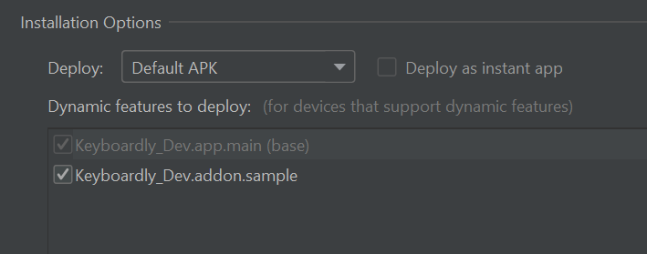

# About

Add On is a feature that helps users to add tools from 3rd party inside your keyboard.<br>
Add on will show in two places:

- Keyboard's navigation menu (add on's submenu)
- App's addon menu choose

Add on from 3rd party will be available on the keyboard or on the app after user installs it from the menu **Add On**.

# Table of contents
- [About](#about)
- [Table of contents](#table-of-contents)
- [Glossary](#glossary)
    * [Dynamic Feature](#dynamic-feature)
    * [Keyboard Action View](#keyboard-action-view)
    * [Keyboard Dependency](#keyboard-action-dependency)
- [Develop Add On](#develop-add-on)
    * [Setup Dependency](#setup-dependency)
    * [Setup Class](#setup-class)
    * [Load Add On](#load-add-on)
    * [Add On Submenu](#add-on-submenu)
    * [App's addon menu](#app's-addon-menu)
    * [Proguard rules](#proguard-rules)
    * [Styling](#styling)
    * [Testing](#testing)
        + [Indicator of success](#indicator-success-launched-of-add-on)

# Glossary
There are several vocabularies used in this development.

## Dynamic Feature
Dynamic Feature is base of add on, to see full detail of this see [feature delivery](https://developer.android.com/guide/playcore/feature-delivery)

## Keyboard Action View
Keyboard Action View is base class for view of add on that will show on keyboard. 
The default parameter is `Keyboard Dependency`. This class is where the feature add on started and showed by user.
See detail [KeyboardActionView](/libraries/actionview/src/main/java/app/keyboardly/lib/KeyboardActionView.kt)

## Keyboard Action Dependency
Keyboard Dependency is way to communicate with the main keyboard.
See detail [KeyboardActionDependency](/libraries/actionview/src/main/java/app/keyboardly/lib/KeyboardActionDependency.kt)

# Develop Add On

See [this module](/addon/sample) for full sample add on.

To create an add on, start by create a dynamic feature:

> File > New > New Module > Choose **Dynamic Feature** > next

On this dialog fill title and chose **on-demand only**

<p align="center">
    
</p>

### Setup Dependency

After creating a dynamic feature module, update gradle dependencies:

```groovy
plugins {
    id 'com.android.dynamic-feature'
    id 'org.jetbrains.kotlin.android'
    id 'kotlin-kapt'
}

dependencies {
    implementation project(":libraries:style")
    implementation project(":libraries:actionview")

    kapt "com.google.dagger:dagger-compiler:$dagger_version"
    implementation "com.google.dagger:dagger:$dagger_version"
    implementation "com.google.dagger:dagger-android-support:$dagger_version"
}
```

### Setup Class
After setup dependencies, We need to create some kotlin class with requirements:
1. A default class
    - inherits `KeyboardActionView`
    - located in the root module
    - example : [SampleView](/addon/sample/src/main/java/app/keyboardly/sample/SampleView.kt).
2. DynamicDagger class
    - contain some component class, interface and module
    - example : [DynamicDagger](/addon/sample/src/main/java/app/keyboardly/sample/di/DynamicDagger.kt).
3. DynamicFeatureImpl.kt
    - should with name `DynamicFeatureImpl`
    - located in the root module
    - should inherit `DynamicFeature`
    - have a constructor with default class that inherits `KeyboardActionView` 
    - full code see [DynamicFeatureImpl](/addon/sample/src/main/java/app/keyboardly/sample/DynamicFeatureImpl.kt).
    On `DynamicFeatureImpl` class, there is 2 override methods:
    1. `getView()`  : will be used for return view.
    2. `getSubMenus()`  : for return submenu to show on keyboard navigation.

4. Start build your own feature on `KeyboardActionView` class. 

### Load Add On

After the user installs an **Add On**, an icon will appear automatically on the keyboard's navigation menu.
If the user clicks the icon, the keyboard will do the validation :

1. if an **Add On** contain a list submenu (not empty), the sub menu will appear on top of the keyboard.
2. if not contained a list submenu, the keyboard will call `getView()` method.

This validation can be a check on [this line code](app/src/main/java/app/keyboardly/dev/keyboard/keypad/keyboardaction/KeyboardNavigation.kt#L163).

### Add On Submenu

This submenu is list of [NavigationMenuModel](/libraries/actionview/src/main/java/app/keyboardly/lib/navigation/NavigationMenuModel.kt),
if you decide to create an add-on without a submenu it can be an empty list (not null).

The list will be called on `DynamicFeatureImpl` class through [override method](/addon/sample/src/main/java/app/keyboardly/sample/DynamicFeatureImpl.kt#L49).

### App's addon menu

App's addon menu is a way to access installed **add on** like the common app menu.
It can be accessed from add on the menu;

1. if installed, the user will be redirected to a fragment of add on by the navigation graph
2. if not, a detail add-on will appear.

To make add on's navigation, follow this way:

1. include a dynamic navigation graph of the add-on to the default navigation graph. for sample:

```xml
<include-dynamic
    android:id="@+id/sample_default_nav"
    app:moduleName="sample"
    app:graphResName="sample_default_nav"
    app:graphPackage="${applicationId}.sample"/>
```

2. set the root navigation id of add-on same with id on include-dynamic.

```xml
<?xml version="1.0" encoding="utf-8"?>
<navigation xmlns:android="http://schemas.android.com/apk/res/android"
    xmlns:app="http://schemas.android.com/apk/res-auto" 
    android:id="@id/sample_default_nav"
    app:startDestination="@id/sampleFragment">
    <!--the id above without plus (@id/...) -->
    ...
</navigation>
```

3. save the id of included dynamic navigation graph to [listNavigation](/app/src/main/java/app/keyboardly/dev/ui/addon/AddOnFragment.kt#L64-72) on AddOnFragment.

done.

## Proguard rules
On the main source code app, the proguard / minify enabled. 
- Make sure the add-on has consumer-rules.pro to prevent error / failed load of the add-on.
- Be patient to keep some important
```proguard
# keep class data
-keep class app.keyboardly.sample.** { *; }
-keep class app.keyboardly.sample.di.** { *; }

-dontwarn com.google.errorprone.annotations.**

# keep the resource / raw file
-keep class *.R
-keep class dagger.* { *; }

-keepclasseswithmembers class **.R$* {
    public static <fields>;
}

```
- Don't forget to keep the model data class if exist.

see full sample [consumer-rules.pro](/addon/sample/consumer-rules.pro).

## Styling
To make your add on fit with keyboard theme, there is two way:
1. Use default theme on library/style.
- check the attribution member on this file [attrs.xml](/libraries/style/src/main/res/values/attrs.xml)
- sample :
```xml
      <EditText
          android:id="@+id/name"
          style="?textActionKeyboardStyle"
          android:layout_width="match_parent"
          android:layout_height="wrap_content"
          android:layout_margin="10dp"
          android:focusable="false"
          android:hint="Name"
          android:inputType="text" />
```
2. Make your own theme and validate through KeyboardDependency. On keyboard dependency there is method
- `isDarkMode()` : for validate the keyboard theme is dark or bright
- `isBorderMode()` : for validate the keyboard button style, with border or not
- sample :
```kotlin

  val style = if(dependency.isDarkMode()) {
      if (dependency.isBorderMode()){
          R.style.YourStyle_Dark_Border
      } else {
          R.style.YourStyle_Dark
      }
  } else {
      if (dependency.isBorderMode()){
          R.style.YourStyle_Border
      } else {
          R.style.YourStyle
      }
  }
  val mThemeContext = ContextThemeWrapper(context, style)
  val inflater = LayoutInflater.from(mThemeContext)
  viewLayout = inflater.inflate(R.layout.home_layout, null)

```


## Testing

1. Add data `add on` to [list add on](/app/src/main/java/app/keyboardly/dev/keyboard/keypad/keyboardaction/KeyboardNavigation.kt#L203).
   `featureNameId` should be same with `module name` when creating dynamic feature module.
2. Open `Run > Edit Configuration..` and make sure the dynamic module checked on `installation-option` section :

<p align="center">
    
</p>

3. Run the code  / `Shift+F10`
4. When the app launches, open the add-on menu (app/keyboard) and do install the add-on.

### Indicator success launched of add-on:

- On the navigation keyboard, if add on clicked `->` success shows submenu/view from add on. And the `add on` works functionally.
- On the App menu, when opening the add-on menu and then clicking the `add on`, it should load the fragment from the add-on (if exist).
