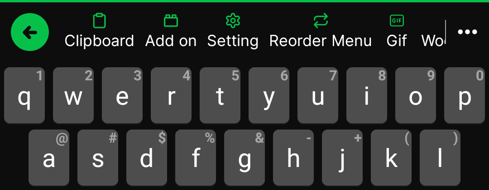
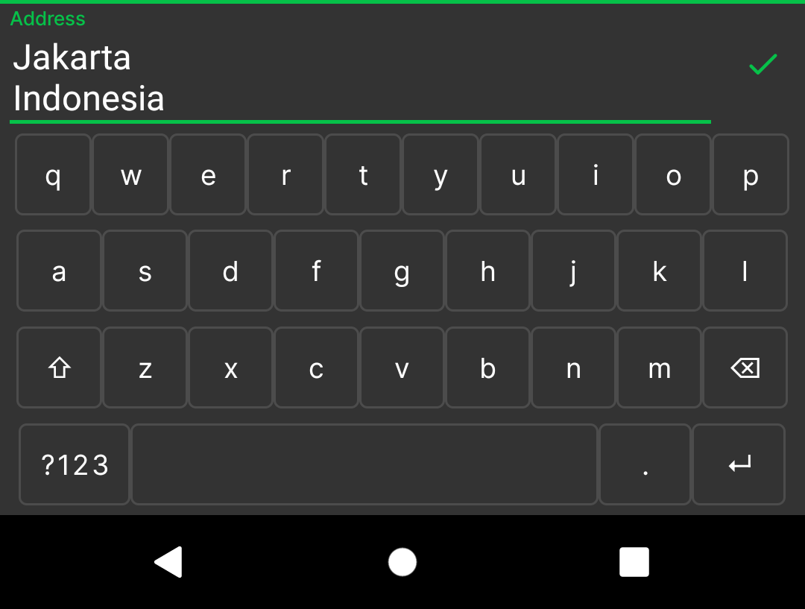
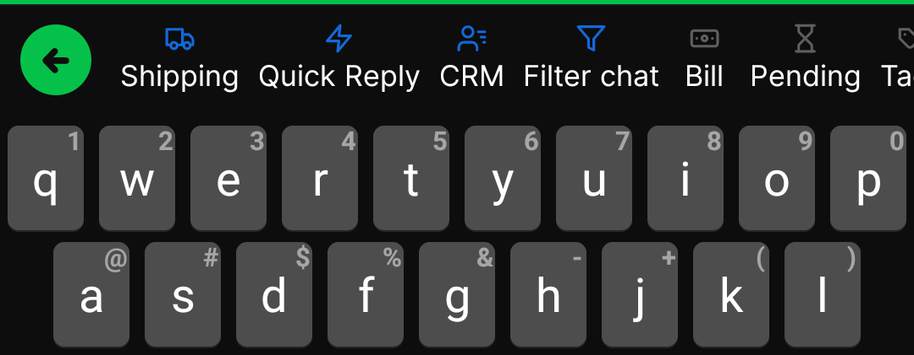

# About

Add On is smart way to make your android keyboard more powerful.<br>
This repository is source code just used for development & testing purpose.

All add on are listed on [marketplace](https://keyboardly.app/addons-marketplace/).

# Table of contents
- [About](#about)
- [Table of contents](#table-of-contents)
- [Glossary](#glossary)
    * [Add On](#add-on)
    * [App's Add On Menu](#apps-add-on-menu)
    * [Default Add On Class](#default-class-add-on)
    * [DynamicDagger Class](#dynamicdagger-class)
    * [DynamicImpl Class](#dynamicfeatureimpl-class)
    * [Dynamic Feature](#dynamic-feature)
    * [EditorInfo](#editorinfo)
    * [InputConnection](#inputconnection)
    * [Interface](#interface)
      + [ChipGroupCallBack](#chipgroupcallback)
      + [InputPresenter](#inputpresenter)
      + [OnViewMessage](#onviewmessage)
      + [OnViewReady](#onviewready)
    * [KeyboardActionView](#keyboard-action-view)
    * [KeyboardDependency](#keyboard-action-dependency)
    * [Keyboard Navigation](#keyboard-navigation)
    * [Request Input](#request-input)
      + [Default Request Input](#default-request-input)
      + [Long Text Request Input](#long-text-request-input)
      + [Chip Options](#chip-options)
      + [Date Picker](#date-picker)
      + [Floating RecyclerView](#floating-recyclerview)
      + [RecyclerView Options](#recyclerview-options)
    * [Submenu Add On Navigation](#submenu-add-on-navigation)
- [Development](#development)
    * [Tools](#tools)
    * [Create Module](#create-module)
    * [Setup Dependency](#setup-dependency)
    * [Setup Class](#setup-class)
    * [Load Add On](#load-add-on)
    * [Add On Submenu](#add-on-submenu)
    * [App's addon Menu Configuration](#apps-addon-menu-configuration)
    * [Styling](#styling)
    * [Proguard rules](#proguard-rules)
    * [Testing](#testing)
      + [Indicator of success](#indicator-success-launched-of-add-on)

# Glossary
There are several vocabularies used in this development.

## Add On
On this development, `Add On` mean a package of dynamic feature that fit and work with `Keyboardly` keyboard ecosystem
with guideline that explained on this documentation.

## App's Add On Menu
App's addon menu is a way to access installed **add on** like the common app menu.
It can be accessed from add on the menu;

1. if installed & configured the navigation, the user will be redirected to a fragment of add on by the navigation graph
2. if not installed or not configured, a detail add-on will appear.

<br>

<br>
It's should to be configured by [this](#apps-addon-menu-configuration)

## Default Class Add On
`Default Class Add On` mean a class that created as a gateway of Add On will loaded & works.
See this sample of default class : [SampleView](/addon/sample/src/main/java/app/keyboardly/sample/SampleView.kt)

## DynamicDagger Class
`DynamicDagger Class` mean a class that contain `@Component` & `@Module` dagger class to build default class.
See this sample of default class : [DynamicDagger](/addon/sample/src/main/java/app/keyboardly/sample/di/DynamicDagger.kt)

## DynamicFeatureImpl Class
`DynamicFeatureImpl` a class for implementation to connect the default class with DynamicDagger class
See this sample of default class : [DynamicFeatureImpl](/addon/sample/src/main/java/app/keyboardly/sample/DynamicFeatureImpl.kt)

## Dynamic Feature
Dynamic Feature is base of add on, to get more information see [feature delivery](https://developer.android.com/guide/playcore/feature-delivery)

## EditorInfo
An editorInfo describes several attributes of a text editing object that an input method is communicating with (typically an EditText), most importantly the type of text content it contains and the current cursor position.
See [detail](https://developer.android.com/reference/android/view/inputmethod/EditorInfo).

## Interface 
There is several interfaces that used on this development.
### ChipGroupCallBack
Used for handle request chips options.
See [detail](/libraries/actionview/src/main/java/app/keyboardly/lib/helper/ChipGroupCallBack.kt).

### InputPresenter
Interface for handling when input mode activated.
See [detail](/libraries/actionview/src/main/java/app/keyboardly/lib/helper/InputPresenter.kt).

### OnViewMessage
For showing message on options area like default RecyclerView and ChipGroup options.
See [detail](/libraries/actionview/src/main/java/app/keyboardly/lib/helper/OnViewMessage.kt).

### OnViewReady
For showing default options with RecyclerView.
See [detail](/libraries/actionview/src/main/java/app/keyboardly/lib/helper/OnViewReady.kt).

## InputConnection
The InputConnection interface is the communication channel from an InputMethod back to the 
application that is receiving its input. It is used to perform such things as reading text 
around the cursor, committing text to the text box, and sending raw key events to the application.
See [detail](https://developer.android.com/reference/android/view/inputmethod/InputConnection).

InputConnection also possible to commit an image, if the input app support to receive it.
See [detail](https://developer.android.com/reference/android/view/inputmethod/InputConnection#commitContent(android.view.inputmethod.InputContentInfo,%20int,%20android.os.Bundle)).

## Keyboard Action View
Keyboard Action View is base class for view of add on that will show on keyboard. 
The default parameter is `Keyboard Dependency`. This class is where the feature add on started and showed by user.
See detail [KeyboardActionView](/libraries/actionview/src/main/java/app/keyboardly/lib/KeyboardActionView.kt)
<p align="center">
    >
</p>

## Keyboard Action Dependency
Keyboard Dependency is interface way to communicate with the main keyboard, it just used inside the keyboard.
See full source [KeyboardActionDependency](/libraries/actionview/src/main/java/app/keyboardly/lib/KeyboardActionDependency.kt)

This is detail of the function member:
<table>
    <tr>
        <td>Name</td>
        <td>Return</td>
        <td>Description</td>
    </tr>
    <tr>
        <td>commitText(text: String)</td>
        <td>-</td>
        <td>commit string data to editor outside keyboard.</td>
    </tr>
    <tr>
        <td>getContext()</td>
        <td>Context</td>
        <td>Get context of keyboard service / theme context.</td>
    </tr>
    <tr>
        <td>getEditTextInput()</td>
        <td>EditText?</td>
        <td>Get current editText while on input mode (inside keyboard)<br>
there is two type EditText, default and long,<br>
- default  : for short input and single line<br>
- long     : for long input and multiline
* return null if keyboard not in input mode.</td>
    </tr>
    <tr>
        <td>getCurrentInputConnection()</td>
        <td>InputConnection</td>
        <td>Get current InputConnection where the keyboard is active</td>
    </tr>
    <tr>
        <td>getCurrentEditorInfo()</td>
        <td>EditorInfo</td>
        <td>Get current active EditorInfo of cursor where the keyboard is active</td>
    </tr>
    <tr>
        <td>getKeyboardHeight()</td>
        <td>Int</td>
        <td>height of current keyboard</td>
    </tr>
    <tr>
        <td>isBorderMode()</td>
        <td>Boolean</td>
        <td>for check current keyboard border theme, is with border or not.</td>
    </tr>
    <tr>
        <td>isDarkMode()</td>
        <td>Boolean</td>
        <td>for check current keyboard theme, is dark mode or not.</td>
    </tr>
    <tr>
        <td>loadingOnInput(loading: Boolean)</td>
        <td>-</td>
        <td>loading view while on input mode.</td>
    </tr>
    <tr>
        <td>setTextWatcher(textWatcher: TextWatcher)</td>
        <td>-</td>
        <td>add text watcher to input edittext while on input mode.</td>
    </tr>
    <tr>
        <td>setActionView(view: KeyboardActionView)</td>
        <td>-</td>
        <td>set view on keyboard layout, like add on menu.</td>
    </tr>
    <tr>
        <td>setActionView(view: View?)</td>
        <td>-</td>
        <td>set view on keyboard layout, like add on menu.</td>
    </tr>
    <tr>
        <td>showChipOptions(...)
</td>
        <td>-</td>
        <td>show chip options from keyboard.</td>
    </tr>
    <tr>
        <td>showDatePicker(...)
</td>
        <td>-</td>
        <td>show date picker from keyboard</td>
    </tr>
    <tr>
        <td>showTitleAboveList(...)</td>
        <td>-</td>
        <td>show title and back button above default Recycler view, same position with keyboard navigation.</td>
    </tr>
    <tr>
        <td>loadingMain(loading: Boolean)</td>
        <td>-</td>
        <td>loading view on main keyboard.</td>
    </tr>
    <tr>
        <td>requestInput(...)</td>
        <td>-</td>
        <td>request input text from keyboard inside a KeyboardActionView</td>
    </tr>
    <tr>
        <td>showRecyclerViewOptions(...)</td>
        <td>-</td>
        <td>show recyclerview options</td>
    </tr>
    <tr>
        <td>showFloatingRecyclerView(...)</td>
        <td>-</td>
        <td>show recyclerview options. the position is above keyboard navigation, usually use when on input mode.</td>
    </tr>
    <tr>
        <td>showMessageView(...)</td>
        <td>-</td>
        <td>show message on main keyboard layout, it's relate with showRecyclerViewOptions for example 
if search on the list, then the result is not found the message can be show up here.</td>
    </tr>
    <tr>
        <td>setNavigationCallback(...)</td>
        <td>-</td>
        <td>set callback navigation when navigation keyboard change to be submenu add on.</td>
    </tr>
    <tr>
        <td>setNavigationMenu(...)</td>
        <td>-</td>
        <td> For set list menu to keyboard navigation. for example: when the add on installed & clicked, 
it should do login first before can access all the menu of add on.
</td>
    </tr>
    <tr>
        <td>viewAddOnNavigation()</td>
        <td>-</td>
        <td>view addon's default submenu navigation if exist.</td>
    </tr>
    <tr>
        <td>viewDefaultKeyboard()</td>
        <td>-</td>
        <td>reset view to default keyboard view</td>
    </tr>
    <tr>
        <td>viewKeyboardNavigation()</td>
        <td>-</td>
        <td>view default keyboard navigation</td>
    </tr>
    <tr>
        <td>viewLayoutAction()</td>
        <td>-</td>
        <td>move back to current view KeyboardActionView. Usually this function will called after call requestInput() function or something else</td>
    </tr>
</table>

## Keyboard Navigation
Keyboard navigation is list menu that appear on top of keyboard.
The default navigation is available when user click the keyboard logo.
<p align="center">
    
</p>
If new add on installed, the logo will appear on this list keyboard navigation.
<p align="center">
    
</p>

## Request Input
`Request Input` mean an activity inside `KeyboardActionView` to request input value like text and can be configured with options view like chip group, date picker, recyclerview, floating recyclerview.

### Default Request Input
The default request input is for short text that fit on single line. <br>
Triggered via [KeyboardActionDependency](#keyboard-action-dependency) > `requestInput()`
<p align="center">
    >
</p>
<br> See sample on [this](/addon/sample/src/main/java/app/keyboardly/sample/action/register/RegisterActionView.kt#L35-43)

### Long Text Request Input
The long request input is for long text but will appeared with scrollable 2 line inside keyboard. <br>
Triggered via [KeyboardActionDependency](#keyboard-action-dependency) > `requestInput()` with value `longInput` = `true`
<p align="center">
    >
</p>
<br> See sample on [this](/addon/sample/src/main/java/app/keyboardly/sample/action/register/RegisterActionView.kt#L45)

### Chip Options
Chip options is view `ChipGroup` that can be configured via [KeyboardActionDependency](#keyboard-action-dependency) > `showChipOptions()`
<p align="center">
    >
</p>
<br> See sample on [this](/addon/sample/src/main/java/app/keyboardly/sample/action/register/RegisterActionView.kt#L69)

### Date Picker
Just like `Chip Options`, a KeyboardActionView can request input date via [KeyboardActionDependency](#keyboard-action-dependency) > `showDatePicker()`
<p align="center">
    >
</p>
<br> See sample on [this](/addon/sample/src/main/java/app/keyboardly/sample/action/register/RegisterActionView.kt#L49)

### Floating RecyclerView
A recyclerview options that show like floating on above keyboard navigation, usually use when on input mode for quick search.
<p align="center">
    
</p>
<br>
To use it, triggered it from [KeyboardDependency](#keyboard-action-dependency) > `showFloatingRecyclerView(...)` and combine it with `requestInput(...)` function.
<br> See sample on [this](/addon/sample/src/main/java/app/keyboardly/sample/action/campaign/CampaignActionView.kt#L109)

### RecyclerView Options
Recyclerview options is that appeared on keyboard area and can can be modify the layout manager as needed.
<p align="center">
    
</p>
<br>
To use it, triggered it from [KeyboardDependency](#keyboard-action-dependency) > `showFloatingRecyclerView(...)` and can be configured with title by `showTitleAboveList()`
<br> See sample on [this](/addon/sample/src/main/java/app/keyboardly/sample/action/shopping/ShoppingActionView.kt#L61)

## Submenu Add On Navigation
If an Add On contain submenu navigation, when user click the add on logo the keyboard will replace
the default keyboard navigation with the submenu. The Add On should handle the event submenu click on default class.
<p align="center">
    
</p>

# Development

See [this module](/addon/sample) for full sample add on.

## Tools

Requires tools & config for development:
<table>
    <tr>
        <td>Name</td>
        <td>Version</td>
    </tr>
    <tr>
        <td>Android Studio</td>
        <td>2021.3.1 (min)</td>
    </tr>
    <tr>
        <td>Gradle</td>
        <td>7.4</td>
    </tr>
    <tr>
        <td>Android Gradle Plugin</td>
        <td>7.3.1</td>
    </tr>
    <tr>
        <td>Kotlin plugin</td>
        <td>1.7.20</td>
    </tr>
    <tr>
        <td>compileSdk</td>
        <td>33</td>
    </tr>
    <tr>
        <td>minSdkVersion</td>
        <td>21</td>
    </tr>
    <tr>
        <td>targetSdkVersion</td>
        <td>33</td>
    </tr>
</table>

## Create Module

To create an add on, start by create a dynamic feature module:

> File > New > New Module > Choose **Dynamic Feature** > next

On this dialog fill title and chose **on-demand only**

<p align="center">
    
</p>

## Setup Dependency

After creating a dynamic feature module, update gradle dependencies:

```groovy
plugins {
    id 'com.android.dynamic-feature'
    id 'org.jetbrains.kotlin.android'
    id 'kotlin-kapt'
}

android{
    ...

    kapt {
        generateStubs = true
    }
    
    ...
}

dependencies {
    implementation project(":libraries:style")
    implementation project(":libraries:actionview")

    kapt "com.google.dagger:dagger-compiler:$dagger_version"
    implementation "com.google.dagger:dagger:$dagger_version"
    implementation "com.google.dagger:dagger-android-support:$dagger_version"
}
```

## Setup Class
After setup dependencies, We need to create some kotlin class with requirements:
1. A default class
    - inherits `KeyboardActionView`
    - located in the root module
    - see example : [SampleView](/addon/sample/src/main/java/app/keyboardly/sample/SampleView.kt).
> An add on can configured with empty submenus and with a default view, or with some submenus without default view.
> If an add on not contain a default view or submenus, the add on will doesn't work.
 
2. DynamicDagger class
    - contain some component class, interface and module
    - should fit with the default class to make it work
    - see example : [DynamicDagger](/addon/sample/src/main/java/app/keyboardly/sample/di/DynamicDagger.kt).

3.DynamicFeatureImpl.kt
    - should with name `DynamicFeatureImpl`
    - located in the root module
    - should inherit `DynamicFeature`
    - have a constructor with default class that inherits `KeyboardActionView` 
    - full code see [DynamicFeatureImpl](/addon/sample/src/main/java/app/keyboardly/sample/DynamicFeatureImpl.kt).
note:
> On DynamicFeatureImpl class, there is 2 override methods:
<br> - `getView()`  : will be used for return view.
<br> - `getSubMenus()`  : for return submenus to show on keyboard navigation.<br>

4. Start build your own feature by `KeyboardActionView` class. 

## Load Add On

After the user installs an **Add On**, an icon will appear automatically on the keyboard's navigation menu.
If the user clicks the icon, the keyboard will do the validation :

1. if an **Add On** contain a list submenu (not empty), the sub menu will appear on top of the keyboard.
2. if not contained a list submenu, the keyboard will call `getView()` method.
<br>

<br>
This validation can be a check on [this line code](app/src/main/java/app/keyboardly/dev/keyboard/keypad/keyboardaction/KeyboardNavigation.kt#L163).

## Add On Submenu

This submenu is list of [NavigationMenuModel](/libraries/actionview/src/main/java/app/keyboardly/lib/navigation/NavigationMenuModel.kt),
if you decide to create an add-on without a submenu it can be an empty list (not null).

The list will be called on `DynamicFeatureImpl` class through [override method](/addon/sample/src/main/java/app/keyboardly/sample/DynamicFeatureImpl.kt#L49).

## App's Addon Menu Configuration
To make app's add on menu, follow this way:

1. include a dynamic navigation graph of the add-on to the default navigation graph. for sample:

```xml
<include-dynamic
    android:id="@+id/sample_default_nav"
    app:moduleName="sample"
    app:graphResName="sample_default_nav"
    app:graphPackage="${applicationId}.sample"/>
```

2. set the root navigation id of add-on same with id on include-dynamic.

```xml
<?xml version="1.0" encoding="utf-8"?>
<navigation xmlns:android="http://schemas.android.com/apk/res/android"
    xmlns:app="http://schemas.android.com/apk/res-auto" 
    android:id="@id/sample_default_nav"
    app:startDestination="@id/default_nav">
    <!--the id above without plus (@id/...) -->

    <!-- startDestination fragment -->
    <fragment
        android:id="@+id/default_nav"
        android:name="app.keyboardly.sample.app.SampleFragment"
        android:label="Sample Fragment"
        tools:layout="@layout/fragment_sample" />
</navigation>
```

3. save the id of included dynamic navigation graph to [listNavigation](/app/src/main/java/app/keyboardly/dev/ui/addon/AddOnFragment.kt#L64-72) on AddOnFragment.

done.

## Styling
To make your add on fit with keyboard theme, there is two way:
1. Use default theme on library/style.
- check the attribution member on this file [attrs.xml](/libraries/style/src/main/res/values/attrs.xml)
- sample :
```xml
      <EditText
          android:id="@+id/name"
          style="?textActionKeyboardStyle"
          android:layout_width="match_parent"
          android:layout_height="wrap_content"
          android:layout_margin="10dp"
          android:focusable="false"
          android:hint="Name"
          android:inputType="text" />
```
2. Make your own theme and validate through KeyboardDependency. On keyboard dependency there is method
- `isDarkMode()` : for validate the keyboard theme is dark or bright
- `isBorderMode()` : for validate the keyboard button style, with border or not
- sample :
```kotlin

  val style = if(dependency.isDarkMode()) {
      if (dependency.isBorderMode()){
          R.style.YourStyle_Dark_Border
      } else {
          R.style.YourStyle_Dark
      }
  } else {
      if (dependency.isBorderMode()){
          R.style.YourStyle_Border
      } else {
          R.style.YourStyle
      }
  }
  val mThemeContext = ContextThemeWrapper(context, style)
  val inflater = LayoutInflater.from(mThemeContext)
  viewLayout = inflater.inflate(R.layout.home_layout, null)

```

## Proguard rules
On the main source code app, the proguard / minify enabled.
- Make sure the add-on has consumer-rules.pro to prevent error / failed load of the add-on.
- Be patient to keep some important
```proguard
# keep class data
-keep class app.keyboardly.sample.** { *; }
-keep class app.keyboardly.sample.di.** { *; }

-dontwarn com.google.errorprone.annotations.**

# keep the resource / raw file
-keep class *.R
-keep class dagger.* { *; }

-keepclasseswithmembers class **.R$* {
    public static <fields>;
}

```
- Don't forget to keep the model data class if exist.

see full sample [consumer-rules.pro](/addon/sample/consumer-rules.pro).


## Testing

1. Add data `add on` to [list add on](/app/src/main/java/app/keyboardly/dev/keyboard/keypad/keyboardaction/KeyboardNavigation.kt#L203).
   `featureNameId` should be same with `module name` when creating dynamic feature module.
2. Open `Run > Edit Configuration..` and make sure the dynamic module checked on `installation-option` section :

<p align="center">
    
</p>

3. Run the code  / `Shift+F10`
4. When the app launches, open the add-on menu (app/keyboard) and do install the add-on.

### Indicator success launched of add-on:

- On the navigation keyboard, if add on clicked `->` success shows submenu/view from add on. And the `add on` works functionally.
- On the App menu, when opening the add-on menu and then clicking the `add on`, it should load the fragment from the add-on (if exist).
