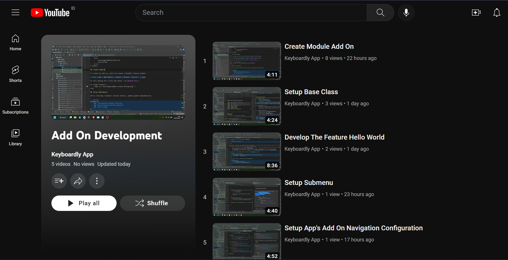
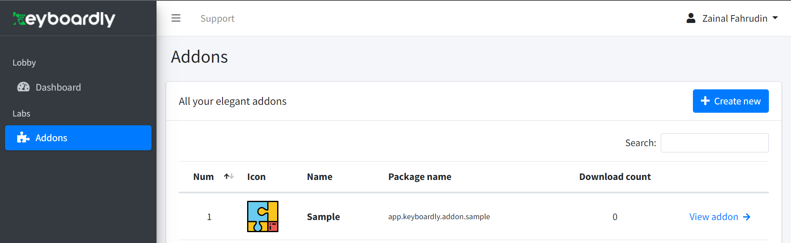

# About

Add On is a smart way to make your Android keyboard more powerful.<br>
This repository is source code just used for development & testing purposes.

All live add-ons are listed on [marketplace](https://keyboardly.app/addons-marketplace/).

# Table of contents

- [About](#about)
- [Table of contents](#table-of-contents)
- [Development](#development)
  * [Tools](#tools)
  * [Register Add On](#register-add-on)
  * [Create Module](#create-module)
  * [Setup build.gradle](#setup-buildgradle)
  * [Setup Base Class](#setup-base-class)
  * [Create The Feature](#create-feature-by-keyboard-action-view)
  * [Code architecture](#code-architecture)
  * [Resource File Rules](#resource-file-rules)
  * [Styling](#styling)
  * [Setup Submenu Add On](#setup-submenu-add-on)
  * [App's addon Navigation Configuration](#apps-addon-navigation-configuration)
  * [Proguard rules](#proguard-rules)
  * [Testing](#testing)
    + [Indicator of success](#indicator-success-launched-of-add-on)
  * [Pre-production Test](#pre-production-test)
    + [Preparation](#preparation)
    + [Build Time](#build-time)

# Development

See [this module](/addon/sample) for full sample add-on.

For the video version, take a look at [this YouTube playlist](https://youtube.com/playlist?list=PLjByoAiq9W7V04GnPbwLmcCuZdA-iiTcE).
[](https://youtube.com/playlist?list=PLjByoAiq9W7V04GnPbwLmcCuZdA-iiTcE)

## Tools

Requires tools & config for development:

<table>
    <tr>
        <td>Name</td>
        <td>Version</td>
    </tr>
    <tr>
        <td>Android Studio</td>
        <td>2022.1.1 / latest version</td>
    </tr>
    <tr>
        <td>Gradle</td>
        <td>7.4</td>
    </tr>
    <tr>
        <td>Android Gradle Plugin</td>
        <td>7.4.1</td>
    </tr>
    <tr>
        <td>Kotlin plugin</td>
        <td>1.7.20</td>
    </tr>
    <tr>
        <td>compileSdk</td>
        <td>33</td>
    </tr>
    <tr>
        <td>minSdkVersion</td>
        <td>21</td>
    </tr>
    <tr>
        <td>targetSdkVersion</td>
        <td>33</td>
    </tr>
</table>

## Register Add On
Before starting to develop `Add On`, a developer must register the add-on and claim the module name id on Keyboardly's developer dashboard.
1. Register on [dev.keyboardly.app](https://dev.keyboardly.app/) and verify.
2. From the dashboard, click `Addons` menu on the left > click the `Create New` button.
3. A dialog like below will appear.

> Note:
> All module names should be unique to prevent crashes/bugs in the future. 

## Create Module

To create an add-on, start by creating a dynamic feature module:

`File > New > New Module > On the left, choose Dynamic Feature`


> <b>Note:<b>
> - the module name should be registered on the dashboard, as explained on [above](#register-add-on).
> - the package ID should have a prefix with `app.keyboardly.addon`

On this dialog fill title and choose **on-demand only**


## Setup build.gradle

After creating a dynamic feature module, update gradle dependencies:

```groovy
plugins {
    id 'com.android.dynamic-feature'
    id 'org.jetbrains.kotlin.android'
    id 'kotlin-kapt'
}

android{
compileSdk rootProject.ext.compileSdkVersion
    defaultConfig {
        minSdk rootProject.ext.minSdkVersion

        // information for versioning
        buildConfigField "int", "ADD_ON_VERSION", "1" // always increase it on update
        buildConfigField "String", "ADD_ON_VERSION_NAME", "\"1.0\""
        buildConfigField "String", "ADD_ON_ID", "\"addon_id\"" // should same with module name
    }

    kapt {
        generateStubs = true
    }

    buildFeatures {
        viewBinding true
    }

    buildTypes {
        release {
            minifyEnabled false
            // proguardFile's configuration like below should be removed
            // proguardFiles getDefaultProguardFile('proguard-android-optimize.txt'), 'proguard-rules.pro'
        }
    }

}

dependencies {
    implementation project(":libraries:style")
    implementation project(":libraries:actionview")

    implementation "androidx.core:core-ktx:$coreKtxVersion"
    implementation "androidx.databinding:viewbinding:$view_binding_version"

    kapt "com.google.dagger:dagger-compiler:$dagger_version"
    implementation "com.google.dagger:dagger:$dagger_version"
    implementation "com.google.dagger:dagger-android-support:$dagger_version"
}
```
> Take attention to proguardFile's configuration, it should be commented on/removed.

## Setup Base Class

After setting up dependencies, We need to create some kotlin classes with requirements:

1. A default class
   - inherits `DefaultClass`
   - located in the root module
   - see example : [SampleDefaultClass](/addon/sample/src/main/java/app/keyboardly/addon/sample/SampleDefaultClass.kt).

> An add-on can configured with an empty submenus and with a top view/default action view, or with some submenus without a default view.
> If an add-on on not contain a default view or submenus, the add-on will not work.

2. DynamicDagger class

   - contain some component class, interface, and module
   - should fit with the default class to make it work
   - see example : [DynamicDagger](/addon/sample/src/main/java/app/keyboardly/addon/sample/di/DynamicDagger.kt).
3. DynamicFeatureImpl.kt

   - should with name `DynamicFeatureImpl`
   - located in the root module
   - should inherit `DynamicFeature`
   - have a constructor with a default class that inherits `KeyboardActionView`
   - full code see [DynamicFeatureImpl](/addon/sample/src/main/java/app/keyboardly/addon/sample/DynamicFeatureImpl.kt).
     note:

> On DynamicFeatureImpl class, there are 3 override methods:
> <br> - `getView()`  : will be used for return view.
> <br> - `getTopView()`  : will be used for top view (optional).
> <br> - `getSubMenus()`  : for return submenus to show on keyboard navigation (optional).<br>

4. Start building your own feature by `KeyboardActionView` class.

## Create Feature by Keyboard Action View

After setting up all the base classes, start developing the feature.

1. Create a new kotlin class with the suffix name `ActionView`, for example, `WelcomeActionView`
2. Inherit `KeyboardActionView` and make the default constructor with `KeyboardActionDependency`

```kotlin
import app.keyboardly.lib.KeyboardActionDependency
import app.keyboardly.lib.KeyboardActionView


class WelcomeActionView(
    dependency: KeyboardActionDependency
) : KeyboardActionView(dependency) {

}
```

3. Implement the function member `onCreate`

```kotlin
override fun onCreate() {

   }
```

4. Create xml layout like a common layout for fragments or activity. Please take a look the [resource file rule](#resource-file-rules) and [styling](#styling).<br>
   And here is some note for layout xml of action view:<br>

   - must contain a back button for navigation back to add on / keyboard navigation, because back press (on physics device) will detect from the launcher system and hide the keyboard itself.
   - the parent layout height should `MATCH_PARENT`
   - minimum height total of about 250 dp, if not the view will look hanging & not fulfill the keyboard
   - for `EditText` set focusable to `false` and use `setOnClickListener` for action `requestInput()`.

5. Define the view binding and initiate the `viewLayout` variable

```kotlin
override fun onCreate() {
        val binding = WelcomeLayoutBinding.inflate(getLayoutInflater())
        viewLayout = binding.root 
    }
```

6. Give some logic as needed like back navigation. Please see [Code Architecture](#code-architecture) about code style and architecture.

```kotlin
binding.apply {
        back.setOnClickListener {
            dependency.viewAddOnNavigation()
        }
    }
```

7. Example request input text.

```kotlin
inputName.setOnClickListener {
        dependency.requestInput(inputName)
    }
```

8. Example logic and showing toast message

```kotlin
submitBtn.setOnClickListener {
        val name = inputName.text.toString()
        inputName.error = null
        if (name.isEmpty()){
            inputName.error = "can't empty"
        } else {
            toast("Welcome $name!")
        }
    }
```

9. Done. Next step do [testing](#testing).

## Code Architecture
1. The main code languages should use Kotlin and Java as alternatives.
2. Always try to practice Kotlin's official [coding-conventions](https://kotlinlang.org/docs/coding-conventions.html)
    - Take detail on [Naming rules](https://kotlinlang.org/docs/coding-conventions.html#naming-rules) to make code easy to understand and maintenance.
3. Some Libraries recommendation :
    - [Android Jetpack](https://developer.android.com/jetpack):  Material design, view binding, Room for database, and others
    - [Retrofit](https://square.github.io/retrofit/) for networking
    - [Chucker](https://github.com/ChuckerTeam/chucker) for network logging
    - [Timber](https://github.com/JakeWharton/timber) for logging
    - [Glide](https://github.com/bumptech/glide) for load images
    - [Koin](https://insert-koin.io/docs/quickstart/android/) for dependency injection
   > see sample implementation of Room, Retrofit, and Koin in [this class](/addon/sample/src/main/java/app/keyboardly/addon/sample/action/province/ProvinceListActionView.kt)
4. Use common code patterns like MVC, MVP, MVVM, and Clean Architecture. Don't put all view and logic code in a single class.
5. We're open to implementing the new technology or suggestions, as long as it works and make it better.

## Resource File Rules

To prevent the risk of conflict when compiling/merging with the main source code, there are some rules for the naming of resource files.

- Resource file here means only files under the resource folder `drawable` and `layout`.
- The file name should start with `add on name id`.
- For example an add-on with the id `sample`, all the files should be like: `sample_login_activity.xml`, `sample_icon_addon.png`.

## Styling

To make your add-on fit with the keyboard theme, there is two way:

1. Use the default theme on library/style.

- check the attribution member on this file [attrs.xml](/libraries/style/src/main/res/values/attrs.xml)
- sample :

```xml
<EditText
          android:id="@+id/name"
          style="?textActionKeyboardStyle"
          android:layout_width="match_parent"
          android:layout_height="wrap_content"
          android:layout_margin="10dp"
          android:focusable="false"
          android:hint="Name"
          android:inputType="text" />
```

2. Make your own theme and validate through KeyboardDependency. On keyboard dependency, there are two method

- `isDarkMode()` : for validate the keyboard theme is dark or bright
- `isBorderMode()` : for validate the keyboard button style, with border or not
- sample :

```kotlin
val style = if(dependency.isDarkMode()) {
      if (dependency.isBorderMode()){
          R.style.YourStyle_Dark_Border
      } else {
          R.style.YourStyle_Dark
      }
  } else {
      if (dependency.isBorderMode()){
          R.style.YourStyle_Border
      } else {
          R.style.YourStyle
      }
  }
  val mThemeContext = ContextThemeWrapper(context, style)
  val inflater = LayoutInflater.from(mThemeContext)
  viewLayout = inflater.inflate(R.layout.home_layout, null)
  
  /* or implement with viewBinding */
  val binding = SampleWelcomeLayoutBinding.inflate(inflater)
  viewLayout = binding.root
```

## Setup Submenu Add On

1. As mentioned on [glossary](/doc/Glossary.md#L332-340), the first step is to add a list of navigation on the default class.

```kotlin
private var menu = mutableListOf<NavigationMenuModel>()

    private fun initMenuList() {
        menu.add(
            NavigationMenuModel(
                WELCOME,
                nameString = "Welcome",
                icon = R.drawable.sample_ic_round_account_circle_24_bot_feature,
            )
        )
    }

    override fun getSubmenus(): MutableList<NavigationMenuModel> {
        if (menu.isEmpty()) {
            initMenuList()
        }
        return menu
    }
```

2. Handle the navigation click by set the navigation callback

```kotlin
override fun getSubmenus(): MutableList<NavigationMenuModel> {
        if (menu.isEmpty()) {
            initMenuList()
        }
        dependency.setNavigationCallback(this)
        return menu
    }
```

3. Then implement function member `onClickMenu`

```kotlin
override fun onClickMenu(data: NavigationMenuModel) {
  
    }
```

4. Add the logic of what should do

```kotlin
override fun onClickMenu(data: NavigationMenuModel) {
        val view = when (data.id) {
            WELCOME -> welcomeActionView
            else -> null
        }

        if (view != null) {
            dependency.setActionView(view)
        } else {
            if (!data.enable) {
                toast("Feature on development")
            } else {
                Timber.w("enable but nothing to parse")
            }
        }
    }
```

5. Done. Run the code.

## App's Addon Navigation Configuration

To make the app's add-on navigation, follow this way:

1. include a dynamic navigation graph of the add-on to the default navigation graph. for sample:

```xml
<include-dynamic
    android:id="@+id/sample_default_nav"
    app:moduleName="sample"
    app:graphResName="sample_default_nav"
    app:graphPackage="${applicationId}.sample"/>
```

2. set the root navigation id of the add-on the same as ID on include-dynamic.

```xml
<?xml version="1.0" encoding="utf-8"?>
<navigation xmlns:android="http://schemas.android.com/apk/res/android"
    xmlns:app="http://schemas.android.com/apk/res-auto" 
    android:id="@id/sample_default_nav"
    app:startDestination="@id/default_nav">
    <!--the id above without plus (@id/...) -->

    <!-- startDestination fragment -->
    <fragment
        android:id="@+id/default_nav"
        android:name="app.keyboardly.sample.app.SampleFragment"
        android:label="Sample Fragment"
        tools:layout="@layout/fragment_sample" />
</navigation>
```

3. insert the add on data to [listAddOn](/app/src/main/java/app/keyboardly/dev/ui/addon/AddOnViewModel.kt#L15-34). Make sure the data match with the add on module configuration.
4. save the id of included dynamic navigation graph to [listNavigation](/app/src/main/java/app/keyboardly/dev/ui/addon/AddOnFragment.kt#L69-77) on AddOnFragment.

done.

## Proguard rules

On the main source code app, the proguard / minify is enabled.

- Make sure the add-on has consumer-rules.pro to prevent error / failed load of the add-on.
- Be patient to keep some important

```proguard
# keep class data
-keep class app.keyboardly.sample.** { *; }
-keep class app.keyboardly.sample.di.** { *; }

-dontwarn com.google.errorprone.annotations.**

# keep the resource / raw file
-keep class *.R
-keep class dagger.* { *; }

-keepclasseswithmembers class **.R$* {
    public static <fields>;
}
```

- Don't forget to keep the model data class if exists.

see full sample [consumer-rules.pro](/addon/sample/consumer-rules.pro).

## Testing

1. Don't forget to insert data `add on` to the [list navigation](../app/src/main/java/app/keyboardly/dev/keyboard/keypad/keyboardaction/KeyboardNavigation.kt#L204-228) as mentioned on [this](#load-add-on)
2. And for navigation app's add-on (if exist) in [this list](/app/src/main/java/app/keyboardly/dev/ui/addon/AddOnViewModel.kt#L15-34) and [list navigation id](/app/src/main/java/app/keyboardly/dev/ui/addon/AddOnFragment.kt#L69-77)
3. Open `Run > Edit Configuration..` and make sure the dynamic module is checked on the `installation-option` section :

<p align="center">
    
</p>

3. Run the app  / `Shift+F10`
4. When the app launches, open the add-on menu (app/keyboard).

### Indicator success launched of add-on:

- On the navigation keyboard, if add on clicked `->` success shows submenu/view from add on. And the `add on` works functionally.
- On the App menu, when opening the add-on menu and then clicking the `add on`, it should load the fragment from the add-on (if exists).

## Pre-production Test
This test is to make sure the add-on is works in production

### Preparation
Before building the addon, please make sure and double-check :
1. The add-on can be installed and opened successfully with the source code on this repo.
2. All views and buttons work properly
3. No display is cut off or has problems with the user experience
4. Work nicely on light and dark themes
5. Nothing force close, ANR / freeze
6. Clean the project from Android Studio by `Build > Clean Project`
7. Compress your addon root folder to a zip file.

<p align="center">
    
</p>

> Note: just compress your add-on root folder, not the 'addon' folder.

### Build Time

1. Goto addon menu on [dashboard](https://dev.keyboardly.app/dashboard/addon) > select your add on
<p align="center">
    
</p>

4. Click the `Build Now` button
<p align="center">
    
</p>

5. Dialog will appear, change the description and icon (optional). Select the zip file and click `Build` button.
<p align="center">
    
</p>

6. The build process is about 15-20 minutes if successful. 
<p align="center">
    
</p>

7. If the build is successful, download the *.apk file and try it on the real device.
8. If failed, check the error detail, fix it, and rebuild.
