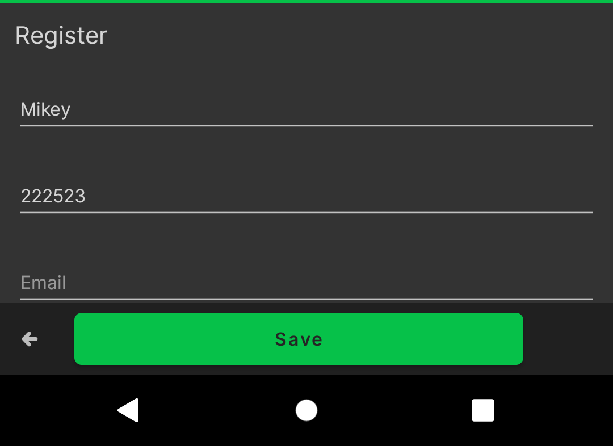
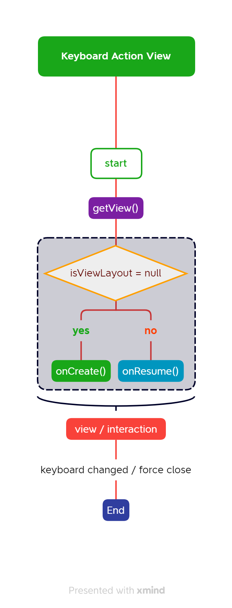
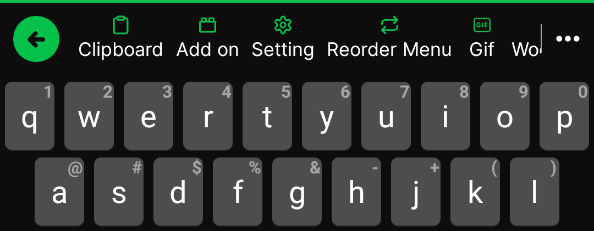
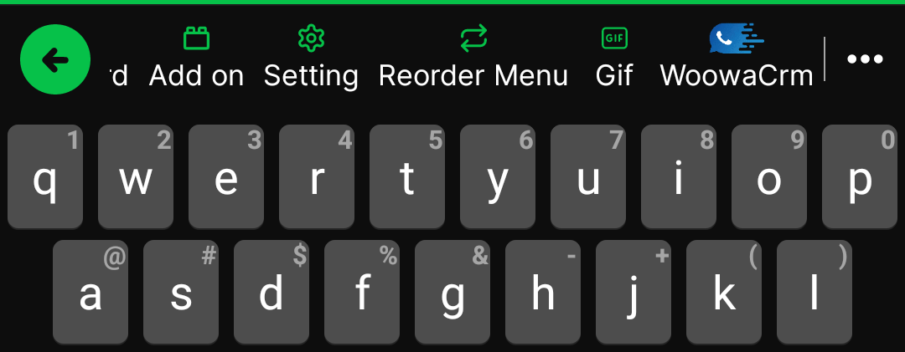
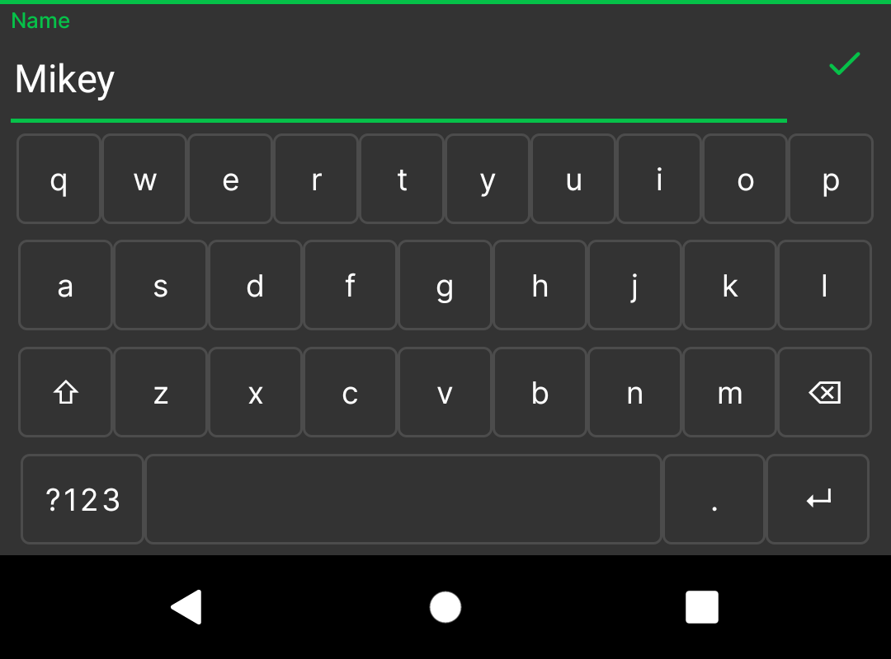
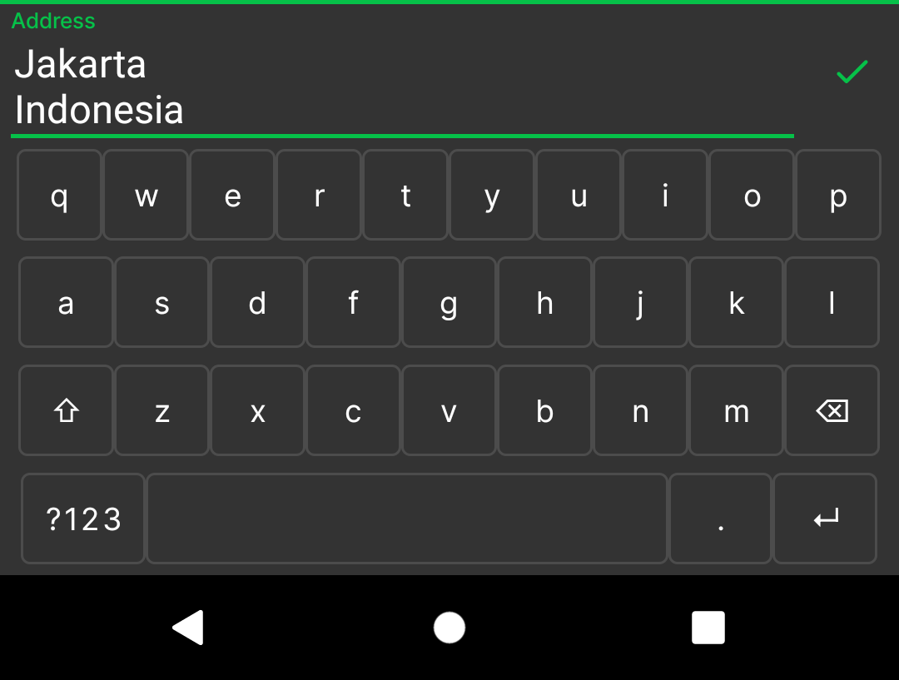
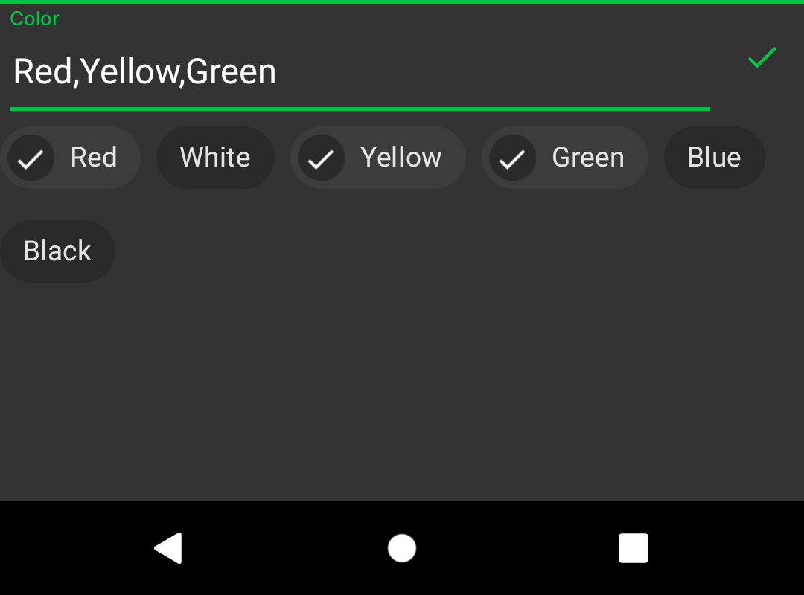
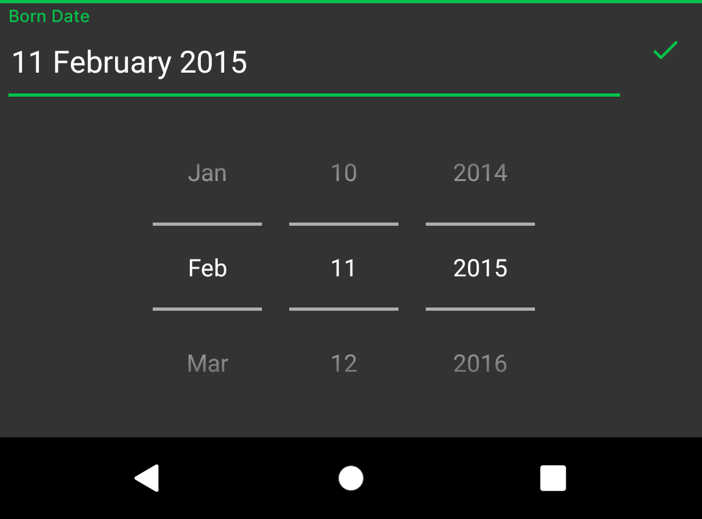
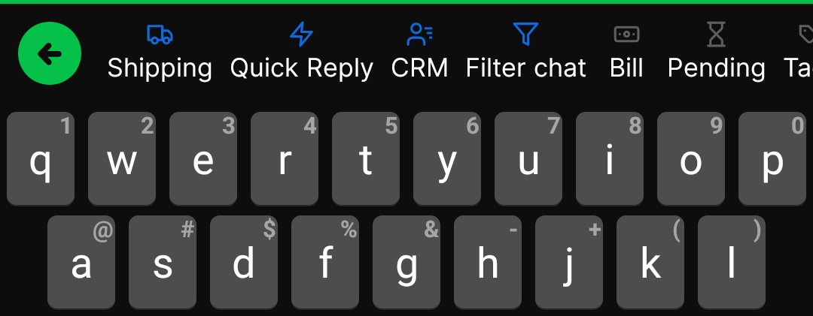

# Glossary
There are several vocabularies that you have to know for this development.

# Table Of Content
- [Add On](#add-on)
- [App's Add-On Navigation](#apps-add-on-navigation)
- [Base Class](#base-class)
- [Default Add On Class](#default-class-add-on)
- [DynamicDagger Class](#dynamicdagger-class)
- [DynamicImpl Class](#dynamicfeatureimpl-class)
- [Dynamic Feature](#dynamic-feature)
- [EditorInfo](#editorinfo)
- [InputConnection](#inputconnection)
- [Interface](#interface)
    * [ChipGroupCallBack](#chipgroupcallback)
    * [InputPresenter](#inputpresenter)
    * [OnViewMessage](#onviewmessage)
    * [OnViewReady](#onviewready)
- [KeyboardActionView](#keyboard-action-view)
    * [Keyboard Action View Flow](#keyboard-action-view-flow)
- [KeyboardDependency](#keyboard-action-dependency)
- [Keyboard Navigation](#keyboard-navigation)
- [Request Input](#request-input)
    * [Default Request Input](#default-request-input)
    * [Long Text Request Input](#long-text-request-input)
    * [Chip Options](#chip-options)
    * [Date Picker](#date-picker)
    * [Top RecyclerView](#top-recyclerview)
    * [RecyclerView Options](#recyclerview-options)
- [Submenu Add On Navigation](#submenu-add-on-navigation)

## Add On
In this development, `Add On` means a module package of a dynamic feature that fits and works with `Keyboardly` keyboard ecosystem
with guidelines that are explained in this documentation.

## App's Add On Navigation
App's addon navigation is a way to access installed **add on** like the common app menu.
It can be accessed from add on the menu;

1. if it's installed & configured the navigation, the user will be redirected to a fragment of add on by the navigation graph
2. if not installed or not configured, a detailed add-on will appear.

It should be configured by [this](./Addon.md#apps-addon-navigation-configuration)

## Base Class
Base Class means several classes that must exist in an add-on. Member of the base class is :
- Default Class Add On
- DynamicDagger Class
- DynamicFeatureImpl Class
 
All the class will explain below.

## Default Class Add On
`Default Class Add On` means a class that is created as a gateway of Add On will load & work.
See this sample of default class : [SampleDefaultClass](/addon/sample/src/main/java/app/keyboardly/addon/sample/SampleDefaultClass.kt)

## DynamicDagger Class
`DynamicDagger Class` means a class that contains `@Component` & `@Module` dagger class to build the default class.
See this sample of default class : [DynamicDagger](/addon/sample/src/main/java/app/keyboardly/addon/sample/di/DynamicDagger.kt)

## DynamicFeatureImpl Class
`DynamicFeatureImpl` is a class for implementation to connect the default class with the DynamicDagger class
See this sample of default class : [DynamicFeatureImpl](/addon/sample/src/main/java/app/keyboardly/addon/sample/DynamicFeatureImpl.kt)

## Dynamic Feature
Dynamic Feature is a base of the add-on, to get more information see [feature delivery](https://developer.android.com/guide/playcore/feature-delivery)

## EditorInfo
An editorInfo describes several attributes of a text editing object that an input method is communicating with (typically an EditText), most importantly the type of text content it contains and the current cursor position.
See [detail](https://developer.android.com/reference/android/view/inputmethod/EditorInfo).

## Interface
There are several interfaces that are used in this development.
### ChipGroupCallBack
Used for handle request chip options.
See [detail](/libraries/actionview/src/main/java/app/keyboardly/lib/helper/ChipGroupCallBack.kt).

### InputPresenter
Interface for handling when input mode is activated.
See [detail](/libraries/actionview/src/main/java/app/keyboardly/lib/helper/InputPresenter.kt).

### OnViewMessage
For showing a message on options areas like default RecyclerView and ChipGroup options.
See [detail](/libraries/actionview/src/main/java/app/keyboardly/lib/helper/OnViewMessage.kt).

### OnViewReady
For showing default options with RecyclerView.
See [detail](/libraries/actionview/src/main/java/app/keyboardly/lib/helper/OnViewReady.kt).

## InputConnection
The InputConnection interface is the communication channel from an InputMethod back to the
application that receives its input. It is used to perform such things as reading text
around the cursor, committing text to the text box, and sending raw key events to the application.
See [detail](https://developer.android.com/reference/android/view/inputmethod/InputConnection).

InputConnection can also commit an image if the input target supports receiving it.
See [detail](https://developer.android.com/reference/android/view/inputmethod/InputConnection#commitContent(android.view.inputmethod.InputContentInfo,%20int,%20android.os.Bundle)).

## Keyboard Action View
Keyboard Action View is the base class for a view of the add-on that will show on the keyboard.
The default parameter is `Keyboard Dependency`. This class is where the feature add-on started and is shown by the user.
See detail [KeyboardActionView](/libraries/actionview/src/main/java/app/keyboardly/lib/KeyboardActionView.kt)

    

### Keyboard Action View Flow
A keyboard action view has a simple flow that should be understood. See diagram below:

    

## Keyboard Action Dependency
Keyboard Dependency is an interface way to communicate with the main keyboard, it is just used inside the keyboard.
See full source [KeyboardActionDependency](/libraries/actionview/src/main/java/app/keyboardly/lib/KeyboardActionDependency.kt)

This is a detail of the function member:
<table>
    <tr>
        <td>Name</td>
        <td>Return</td>
        <td>Description</td>
    </tr>
    <tr>
        <td>commitText(text: String)</td>
        <td>-</td>
        <td>commit string data to an editor outside the keyboard.</td>
    </tr>
    <tr>
        <td>getContext()</td>
        <td>Context</td>
        <td>Get the context of keyboard service/theme context.</td>
    </tr>
    <tr>
        <td>getEditTextInput()</td>
        <td>EditText?</td>
        <td>Get current editText while on input mode (inside keyboard) 
there are two types of EditText, default and long, 
- default: for short input and single line 
- long: for long input and multiline
* return null if the keyboard is not in input mode.</td>
    </tr>
    <tr>
        <td>getCurrentInputConnection()</td>
        <td>InputConnection</td>
        <td>Get current InputConnection where the keyboard is active</td>
    </tr>
    <tr>
        <td>getCurrentEditorInfo()</td>
        <td>EditorInfo</td>
        <td>Get the current active EditorInfo of the cursor where the keyboard is active</td>
    </tr>
    <tr>
        <td>getKeyboardHeight()</td>
        <td>Int</td>
        <td>height of current keyboard</td>
    </tr>
    <tr>
        <td>isBorderMode()</td>
        <td>Boolean</td>
        <td>To check the current keyboard border theme, is border or non-border.</td>
    </tr>
    <tr>
        <td>isDarkMode()</td>
        <td>Boolean</td>
        <td>For checking the current keyboard theme, is it dark mode or not. </td>
    </tr>
    <tr>
        <td>loadingOnInput(loading: Boolean)</td>
        <td>-</td>
        <td>loading view while on input mode.</td>
    </tr>
    <tr>
        <td>setTextWatcher(textWatcher: TextWatcher)</td>
        <td>-</td>
        <td> Add text watcher to input `edittext` while on input mode.</td>
    </tr>
    <tr>
        <td>setActionView(view: KeyboardActionView)</td>
        <td>-</td>
        <td> Set view on keyboard layout, like add on menu.</td>
    </tr>
    <tr>
        <td>setActionView(view: View?)</td>
        <td>-</td>
        <td> Set view on keyboard layout, like add on menu.</td>
    </tr>
    <tr>
        <td>showChipOptions(...)
</td>
        <td>-</td>
        <td> Show chip options from the keyboard.</td>
    </tr>
    <tr>
        <td>showDatePicker(...)
</td>
        <td>-</td>
        <td>show date picker from keyboard</td>
    </tr>
    <tr>
        <td>showTitleAboveList(...)</td>
        <td>-</td>
        <td>Show title and back button above default Recycler view, same position with keyboard navigation.</td>
    </tr>
    <tr>
        <td>loadingMain(loading: Boolean)</td>
        <td>-</td>
        <td>loading view on the main keyboard.</td>
    </tr>
    <tr>
        <td>requestInput(...)</td>
        <td>-</td>
        <td> Request input text from keyboard inside a KeyboardActionView</td>
    </tr>
    <tr>
        <td>showRecyclerViewOptions(...)</td>
        <td>-</td>
        <td>show recycler view options</td>
    </tr>
    <tr>
        <td>showFloatingRecyclerView(...)</td>
        <td>-</td>
        <td>show recyclerview options. the position is above keyboard navigation, usually used when in input mode.</td>
    </tr>
    <tr>
        <td>showMessageView(...)</td>
        <td>-</td>
        <td>show message on the main keyboard layout, it's related with showRecyclerViewOptions for example 
if search on the list, then the result is not found the message can be shown here.</td>
    </tr>
    <tr>
        <td>setNavigationCallback(...)</td>
        <td>-</td>
        <td> Set callback navigation when the navigation keyboard changes to a submenu add-on.</td>
    </tr>
    <tr>
        <td>setNavigationMenu(...)</td>
        <td>-</td>
        <td>Set the list menu to keyboard navigation. for example: when the add-on is installed & clicked, 
it should log in first before can access all the menu of the add-on.
</td>
    </tr>
    <tr>
        <td>viewAddOnNavigation()</td>
        <td>-</td>
        <td> View the addon's default submenu navigation if exists.</td>
    </tr>
    <tr>
        <td>viewDefaultKeyboard()</td>
        <td>-</td>
        <td>reset view to default keyboard view</td>
    </tr>
    <tr>
        <td>viewKeyboardNavigation()</td>
        <td>-</td>
        <td>view default keyboard navigation</td>
    </tr>
    <tr>
        <td>viewLayoutAction()</td>
        <td>-</td>
        <td>Move back to the current view of KeyboardActionView. Usually, this function will called after calling `requestInput()` function or something else</td>
    </tr>
    <tr>
        <td>showDialog()</td>
        <td>-</td>
        <td>function to show an alert dialog from keyboard</td>
    </tr>
    <tr>
        <td>hideTopView()</td>
        <td>-</td>
        <td>function to hide view above the keyboard, like</td>
    </tr>
    <tr>
        <td>setTopActionView(view: KeyboardActionView)</td>
        <td>-</td>
        <td>Set top view on keyboard layout, like add on menu.</td>
    </tr>
    <tr>
        <td>setTopActionView(view: View?)</td>
        <td>-</td>
        <td> Set top view on keyboard layout, like add on menu.</td>
    </tr>
    <tr>
        <td>setKeyboardHeight(percent: Int)</td>
        <td>-</td>
        <td> Set height keyboard runtime.</td>
    </tr>
    <tr>
        <td>doBackSpace</td>
        <td>-</td>
        <td> function for backspace on current active editor.</td>
    </tr>
</table>

## Keyboard Navigation
Keyboard navigation is a list menu that appears on top of the keyboard.
The default navigation is available when the user clicks the keyboard logo.

    

If a new add-on is installed, the logo will appear on this list keyboard navigation.

    

## Request Input
`Request Input` means an activity inside `KeyboardActionView` to request input value like text and can be configured with options views like chip group, date picker, recyclerview, and top recyclerview.

### Default Request Input
The default request input is for a short text that fits on a single line.  
Triggered via [KeyboardActionDependency](#keyboard-action-dependency) > `requestInput()`

    

  

See sample on [this](/addon/sample/src/main/java/app/keyboardly/addon/sample/action/register/RegisterActionView.kt#L35-43)

### Long Text Request Input
The long request input is for long text but will appear with scrollable 2 lines inside the keyboard.  
Triggered via [KeyboardActionDependency](#keyboard-action-dependency) > `requestInput()` with value `longInput` = `true`

    

 

See sample on [this](/addon/sample/src/main/java/app/keyboardly/addon/sample/action/register/RegisterActionView.kt#L45)

### Chip Options
Chip options are `ChipGroup` that can be configured via [KeyboardActionDependency](#keyboard-action-dependency) > `showChipOptions()`

    

  

See sample on [this](/addon/sample/src/main/java/app/keyboardly/addon/sample/action/register/RegisterActionView.kt#L52-59)

### Date Picker
Just like `Chip Options`, a KeyboardActionView can request input date via [KeyboardActionDependency](#keyboard-action-dependency) > `showDatePicker()`

    

 

See sample on [this](/addon/sample/src/main/java/app/keyboardly/addon/sample/action/register/RegisterActionView.kt#L49)

### Top RecyclerView
A recyclerview option that shows on top keyboard navigation. Usually, used when on input mode for quick search.

    

 
To use it, triggered it from [KeyboardDependency](#keyboard-action-dependency) > `showTopRecyclerView(...)` and combine it with `requestInput(...)` function.
 

See sample on [this](/addon/sample/src/main/java/app/keyboardly/addon/sample/action/campaign/CampaignActionView.kt#L109)

### RecyclerView Options
Recyclerview options that appeared on the keyboard area. Can be modified by the layout manager as needed.

    

 
To use it, triggered it from [KeyboardDependency](#keyboard-action-dependency) > `showTopRecyclerView(...)` and can be configured with title by `showTitleAboveList()`
 

See sample on [this](/addon/sample/src/main/java/app/keyboardly/addon/sample/action/shopping/ShoppingActionView.kt#L61)

## Submenu Add On Navigation
This submenu is a list of [NavigationMenuModel](/libraries/actionview/src/main/java/app/keyboardly/lib/navigation/NavigationMenuModel.kt),
if you decide to create an add-on without a submenu it can be an empty list (not null).  
If an add-on contains submenu navigation and then if the user clicks the add-on logo, the default keyboard navigation will be replaced with the submenus. 
 
The list will be called on `DynamicFeatureImpl` class through [override method](/addon/sample/src/main/java/app/keyboardly/addon/sample/DynamicFeatureImpl.kt#L57-59).
The add-on should handle the submenu click event on the default class.

    

 
On the production version, after the user installs an **Add On**, an icon will appear automatically on the keyboard's navigation menu.
If the user clicks the icon, the keyboard will do the validation :

1. if an **Add On** contains a list submenu (not empty), the sub menu will appear on top of the keyboard.
2. if not contain a list submenu, the keyboard will call `getTopView()` method.
2. if topView returns null, then the keyboard will call `getView()` method.

On the development version, the download process was skipped. The add-on package is just included in compiling the process.
To make it ready to use on the keyboard, add the menu to [this navigation list](../app/src/main/java/app/keyboardly/dev/keyboard/keypad/keyboardaction/KeyboardNavigation.kt#L204-228).
The below data should match with the add-on when creating a dynamic feature module.

